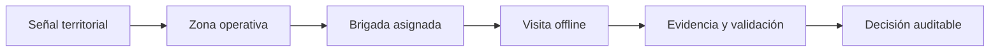

<div align="center">

# PULSO ATLAS

### Del territorio a la acción verificable

Infraestructura local-first para coordinar cobertura, brigadas, necesidades y evidencia durante emergencias, incluso cuando la conectividad es limitada.

[**pulso.my**](https://pulso.my) · [Visión](docs/00-vision.md) · [Arquitectura](docs/02-technical-architecture.md) · [Construir el proyecto](docs/08-development.md)


</div>

---

## Qué es PULSO ATLAS

PULSO ATLAS convierte reportes dispersos del territorio en información operacional trazable. La primera implementación está enfocada en Colombia; el protocolo y el modelo de datos están diseñados para adaptarse a distintos países y a terremotos, inundaciones, incendios, huracanes y otras emergencias.

El MVP comienza por responder cinco preguntas:

1. ¿Qué zonas fueron visitadas?
2. ¿Qué zonas siguen sin verificar?
3. ¿Qué daños y necesidades fueron observados?
4. ¿Quién produjo o validó cada dato?
5. ¿Qué evidencia respalda cada decisión?

> **Decisión de alcance:** el P0 prioriza mapa, cobertura, brigadas y evidencia. Blockchain, tokenización y distribución de dinero no forman parte del MVP inicial.

## Cómo funciona



Los eventos se registran sin sobrescribir el historial. Una visita conserva el momento en que ocurrió en campo y el momento en que fue sincronizada, permitiendo operar con conectividad intermitente sin perder trazabilidad.

## Componentes

| Componente | Responsabilidad |
| --- | --- |
| **Atlas Field** | Aplicación PWA offline para brigadas y captura en terreno. |
| **Atlas Operations** | Consola privada de coordinación, priorización y revisión. |
| **Atlas Map** | Cobertura, acceso, daño y necesidades sobre el territorio. |
| **Recovery Passport** | Expediente versionado de cada caso, vivienda o activo. |
| **Atlas Verify** | Identidad, certificaciones, evidencia y validación. |
| **Pulso Atlas Protocol** | Contratos abiertos de datos, sincronización y auditoría. |

## Estado actual

| Área | Estado |
| --- | --- |
| Mapa departamental de Colombia | Implementado con geometrías derivadas del DANE |
| Territorios, zonas y cobertura | API y contratos implementados |
| Visitas de campo | Inicio, cierre e idempotencia implementados |
| Organizaciones, actores y equipos | API, membresías y validación de alcance implementadas |
| Asignaciones de campo | Creación, aceptación e idempotencia implementadas |
| Captura offline | Cola durable en IndexedDB; sincronización automática pendiente |
| Experiencia móvil de brigada | Activación en tres pasos y guardado offline implementados |
| PostgreSQL/PostGIS | Migraciones y adaptador implementados; integración real pendiente |
| Evidencia, actores y certificaciones | Diseñados; implementación pendiente |
| Donaciones de materiales | Modelo y trazabilidad documentados |

Los estados y cifras visibles en la interfaz actual son **sintéticos**. La investigación de emergencia conserva fecha, fuente y nivel de confianza; no debe interpretarse como un reporte oficial en tiempo real.

## Arquitectura

El P0 utiliza un **monolito modular con workers**: mantiene transacciones simples y despliegue rápido sin perder límites claros entre dominios.

| Capa | Tecnología |
| --- | --- |
| Web y campo | Next.js, React y TypeScript |
| Captura offline | IndexedDB y mutaciones idempotentes |
| API | Fastify y contratos Zod |
| Datos territoriales | PostgreSQL + PostGIS |
| Procesamiento asíncrono | Redis + BullMQ |
| Evidencia | Almacenamiento compatible con S3 |
| Identidad e interoperabilidad | OIDC y OpenAPI |

Consulta la [arquitectura técnica](docs/02-technical-architecture.md), el [modelo de datos](docs/03-data-model.md) y las [decisiones ADR](docs/decisions/) para el detalle completo.

## Inicio rápido

### Requisitos

- Node.js 22 o superior.
- pnpm 10.
- PostgreSQL/PostGIS y Redis son opcionales para el desarrollo inicial.

### Ejecutar localmente

```bash
pnpm install
cp .env.example .env
pnpm dev
```

| Servicio | Dirección |
| --- | --- |
| Web | `http://localhost:3000` |
| Vista móvil de brigada | `http://localhost:3000/field` |
| API | `http://localhost:3001` |
| Salud de la API | `GET http://localhost:3001/health` |

La API usa memoria por defecto. Después de ejecutar las migraciones, PostgreSQL/PostGIS se activa explícitamente:

```bash
PERSISTENCE_DRIVER=postgres pnpm --filter @pulso/api dev
```

Verificación completa del repositorio:

```bash
pnpm check
```

La [guía de desarrollo](docs/08-development.md) explica la estructura, los comandos y las reglas de contribución técnica.

<details>
<summary><strong>Endpoints implementados</strong></summary>

- `GET|POST /v1/incidents`
- `GET /v1/incidents/:incidentId/territories`
- `POST /v1/incidents/:incidentId/territories/import`
- `GET|POST /v1/incidents/:incidentId/operational-zones`
- `GET /v1/incidents/:incidentId/coverage`
- `GET|POST /v1/operational-zones/:zoneId/coverage-events`
- `GET|POST /v1/operational-zones/:zoneId/field-visits`
- `POST /v1/field-visits/:visitId/complete`
- `GET|POST /v1/incidents/:incidentId/organizations`
- `GET|POST /v1/incidents/:incidentId/actors`
- `GET|POST /v1/incidents/:incidentId/teams`
- `GET|POST /v1/teams/:teamId/memberships`
- `GET|POST /v1/incidents/:incidentId/assignments`
- `POST /v1/assignments/:assignmentId/accept`
- `POST /v1/assignments/:assignmentId/invitations`
- `POST /v1/field-access/redeem`
- `POST /v1/field-access/passkeys/registration/options`
- `POST /v1/field-access/passkeys/registration/verify`
- `POST /v1/field-access/passkeys/authentication/options`
- `POST /v1/field-access/passkeys/authentication/verify`

</details>

## Documentación

### Producto y operación

- [Visión y principios](docs/00-vision.md)
- [MVP de emergencia](docs/01-emergency-mvp.md)
- [Investigación y despliegue en Colombia](docs/06-colombia-response.md)
- [Plan de construcción](docs/07-roadmap.md)
- [Donaciones de materiales de construcción](docs/10-material-donations.md)
- [Mapa preliminar de afectación](research/colombia-2026/mapa-impacto-terremoto.html)

### Ingeniería

- [Arquitectura técnica](docs/02-technical-architecture.md)
- [Modelo de datos](docs/03-data-model.md)
- [Sincronización offline](docs/04-offline-sync.md)
- [Cobertura completa de arquitectura](docs/09-architecture-coverage.md)
- [Flujos, eventos y contratos de API](docs/11-operational-events-api.md)
- [Seguridad y preparación de producción](docs/12-production-readiness.md)
- [Vertical territorial y de cobertura](docs/13-territory-coverage-vertical.md)
- [Persistencia y visitas offline](docs/14-persistence-field-offline.md)
- [Equipos y asignaciones de campo](docs/15-teams-field-assignments.md)
- [Experiencia de campo con cero fricción](docs/16-zero-friction-field-ux.md)
- [Invitaciones de misión y passkeys](docs/17-mission-access-passkeys.md)
- [Identidad y confianza operacional](docs/18-identity-trust-p0.md)
- [Evaluación rápida offline](docs/19-rapid-assessments-offline.md)
- [Evidencia fotográfica offline](docs/20-offline-photo-evidence.md)

### Confianza y decisiones

- [Confianza, fraude y privacidad](docs/05-trust-fraud-privacy.md)
- [Decisiones de arquitectura](docs/decisions/)
- [Documento fundacional v0.2](docs/foundation/RecoveryChain_Protocol_v0.2.docx)

## Principios

- **Offline-first:** el trabajo de campo no depende de una conexión continua.
- **Evidencia antes que afirmaciones:** toda decisión importante debe poder justificarse.
- **Historial antes que sobrescritura:** corregir agrega una nueva versión o evento.
- **Privacidad por diseño:** transparencia operacional no significa exposición de datos sensibles.
- **Estándares abiertos:** los datos deben poder migrarse e interoperar.
- **Infraestructura proporcional:** la complejidad se incorpora cuando una necesidad real la justifica.

## Dominio y licencia

- Dominio oficial: [**pulso.my**](https://pulso.my)
- Implementación inicial: **PULSO ATLAS Colombia**
- Estado: **P0 en construcción**

La licencia del código y la licencia de datos se definirán antes de aceptar contribuciones externas. No debe asumirse una licencia hasta que exista un archivo `LICENSE` aprobado.
