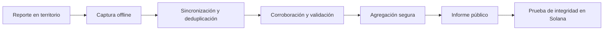

<div align="center">

# PULSO

### Información territorial para actuar

Infraestructura abierta y local-first para coordinar emergencias, hacer visible lo que ocurre en el territorio y demostrar cómo llega la ayuda.

[**pulso.my**](https://pulso.my) · [Dirección y prioridades](docs/32-direccion.md) · [Backlog](docs/33-backlog.md) · [Cómo contribuir](CONTRIBUTING.md) · [Arquitectura](docs/02-technical-architecture.md)


</div>


## Qué es PULSO

PULSO convierte señales dispersas del territorio en información útil, trazable y publicable durante una emergencia. Conecta comunidades, brigadas, profesionales, organizaciones, donantes y autoridades sin exigir conectividad permanente ni conocimientos técnicos.

La primera implementación está enfocada en Colombia, pero el protocolo puede adaptarse a terremotos, inundaciones, incendios, huracanes y otras emergencias en cualquier país.

El sistema responde seis preguntas esenciales:

1. ¿Qué territorios fueron visitados y cuáles siguen sin verificar?
2. ¿Qué daños fueron reportados, corroborados o validados?
3. ¿Qué necesitan las comunidades y con qué prioridad?
4. ¿Qué insumos y donaciones fueron recibidos, asignados o entregados?
5. ¿Qué equipos están trabajando y qué evidencia respalda su actividad?
6. ¿El informe público conserva la misma integridad con la que fue publicado?

Desde el cuarto día, PULSO no crea un censo digital paralelo: enlaza señales comunitarias, visitas de campo y referencias oficiales en un expediente común. Una persona puede ser atendida sin documento; una referencia no se convierte automáticamente en beneficiario y una posible duplicidad siempre pasa por revisión humana.

## Informe público

La portada de `pulso.my` está diseñada como un informe territorial abierto, no como una landing promocional. Presenta sobre un mapa:

- cobertura y zonas todavía sin verificar;
- daños y viviendas pendientes de inspección;
- necesidades, brechas e insumos en tránsito;
- donaciones registradas, conciliadas, asignadas y entregadas;
- equipos programados, desplegados y activos;
- fecha de corte, fuente y nivel de confianza de cada agregado.

La navegación sigue la jerarquía:

`Colombia → departamento → municipio/distrito → ciudad/localidad → zona operativa`

Las cifras que se publican salen de fuentes reales con procedencia: SGC, DANE, USGS, SECOP II, el repositorio oficial de Cali y reportes ciudadanos. Cuando un dato todavía no existe, la interfaz lo dice y explica por qué — nunca se rellena con un número de demostración. Ver [`26-source-ingestion.md`](docs/26-source-ingestion.md).

## Cómo funciona



PostgreSQL/PostGIS es la fuente de verdad operacional. Solana no almacena personas, fotografías, ubicaciones de hogares ni detalles de beneficiarios: conserva únicamente compromisos criptográficos que permiten demostrar que un corte publicado no fue modificado.

## Productos

| Producto | Responsabilidad |
| --- | --- |
| **Pulso Campo** | Aplicación móvil offline para brigadas, visitas, evaluaciones y evidencia. |
| **Pulso Operaciones** | Consola privada para coordinar equipos, priorizar zonas y revisar información. |
| **Pulso Mapa** | Informe público de cobertura, daños, necesidades, donaciones y equipos. |
| **Pasaporte de Recuperación** | Expediente versionado de cada caso, vivienda, animal o activo. |
| **Pulso Verifica** | Identidad, credenciales profesionales, evidencia y validación. |
| **Protocolo PULSO** | Contratos abiertos de datos, sincronización, auditoría e integridad. |

## Prioridades

Los cuatro objetivos **están ordenados**: no son áreas paralelas, son fases de una misma cadena. Ante
dos tareas gana la de prioridad más alta, siempre. El razonamiento está en
[`32-direccion.md`](docs/32-direccion.md).

| | Objetivo | Estado |
| --- | --- | --- |
| **P0** | **Salvar vidas** — dónde hay gente atrapada y quién puede llegar | Reporte ciudadano en pie; falta la cola de coordinación |
| **P1** | **Saber quién quedó afectado** — quiénes son y qué necesitan | Solo modelo de datos; sin API |
| **P2** | **Conectar la ayuda con quien la necesita** | Necesidades y acopios visibles; sin emparejar |
| **P3** | **Trazar la plata pública** — en qué se gasta y si llegó | Funcionando sobre SECOP II |

La prioridad más avanzada es la más baja de las cuatro. Está dicho a propósito: una persona bajo
escombros tiene horas, un contrato mal adjudicado tiene años y tribunales, y construir en orden
inverso a la urgencia es el error más fácil de cometer aquí.

## Estado actual

| Área | Estado |
| --- | --- |
| Informe público y mapa | En producción con datos reales y procedencia por fuente |
| Reporte ciudadano | Rescate, PMU y necesidad; publica sin cuenta y con límite de tasa |
| Auditoría de recursos públicos | SECOP II ingerido, revisión humana y lectura previa con Claude |
| API pública de solo lectura | Implementada y cacheable |
| Mapa territorial | DANE MGN 2023: 33 departamentos y 1.121 municipios |
| Captura de campo offline | Visitas, evaluaciones, evidencia y cola IndexedDB |
| Identidad operacional | Invitaciones, sesiones, passkeys y perfiles de confianza |
| Equipos y asignaciones | Creación, membresías, aceptación e idempotencia |
| Donaciones e inventario | Modelado en migración; sin API |
| Personas y hogares afectados | Modelado en migración; **sin API** — es el hueco más grande |
| Fuentes conectadas | SGC, DANE, USGS, SECOP II, Cali oficial y cuatro plataformas ciudadanas |
| PostgreSQL/PostGIS | 24 migraciones aplicadas en producción |
| Solana | Programa Anchor probado en local; Devnet pendiente |
| Program ID | `PuLsRBUdu4JxfP9tPU4WyNvWx7Vu2dS7NfCipm8YBmh` |

## Donaciones y materiales

PULSO no suma materiales incompatibles ni confunde promesas con entregas. Cada insumo utiliza una unidad canónica y conserva especificación, lote, inspección y movimiento.

```text
promesa → recepción → inspección → aceptación → almacenamiento
        → asignación → despacho → entrega → confirmación
```

La brecha territorial se calcula así:

```text
necesidad validada − entrega utilizable − tránsito confirmado = brecha abierta
```

Consulta el [modelo operativo de donaciones](docs/10-material-donations.md) y el [informe público territorial](docs/24-public-situation-report.md).

## Arquitectura

El P0 usa un monolito modular con workers para mantener despliegues rápidos y transacciones simples.

| Capa | Tecnología |
| --- | --- |
| Web, mapa y campo | Next.js, React y TypeScript |
| Captura offline | IndexedDB y mutaciones idempotentes |
| API | Fastify y contratos Zod |
| Datos territoriales | PostgreSQL + PostGIS |
| Procesamiento asíncrono | Redis + workers |
| Evidencia | Almacenamiento compatible con S3 |
| Identidad | Passkeys/WebAuthn, roles y credenciales verificables |
| Integridad pública | Raíces Merkle ancladas por `pulso_anchor` en Solana |

Principio de disponibilidad: una falla de internet, Solana, RPC o relayer nunca bloquea el registro ni la atención de una emergencia.

## Privacidad y confianza

- La vista pública utiliza agregados territoriales.
- Las ubicaciones precisas de hogares se generalizan o se ocultan.
- No se publican nombres, teléfonos, documentos ni historiales sensibles.
- Reportar, validar, asignar y confirmar entrega son responsabilidades separadas.
- Las correcciones agregan una nueva versión; no sobrescriben silenciosamente el historial.
- Blockchain prueba integridad posterior, no verdad de origen.

## Inicio rápido

### Requisitos

- Node.js 22 o superior.
- pnpm 10.
- Anchor 0.31 y Solana CLI para el programa blockchain.
- PostgreSQL/PostGIS y Redis para persistencia e integración completa.

### Ejecutar localmente

```bash
pnpm install
cp .env.example .env
pnpm dev
```

| Servicio | Dirección |
| --- | --- |
| Informe público | `http://localhost:3000` |
| Pulso Campo | `http://localhost:3000/field` |
| Pulso Operaciones | `http://localhost:3000/operations` |
| API | `http://localhost:3001` |
| Salud | `GET http://localhost:3001/health` |
| Corte público | `GET http://localhost:3001/v1/public/incidents/colombia-2026/report` |
| Fuente oficial Cali | `GET http://localhost:3001/v1/public/sources/cali-official-earthquake-repository/snapshot` |
| Eventos SGC | `GET http://localhost:3001/v1/public/sources/sgc-realtime-earthquakes/snapshot` |
| Geometrías DANE | `GET http://localhost:3001/v1/public/incidents/colombia-2026/territories?level=department` |

La API utiliza memoria para demostración. PostgreSQL se activa explícitamente después de aplicar las migraciones:

```bash
PERSISTENCE_DRIVER=postgres pnpm --filter @pulso/api dev
```

Validación completa:

```bash
pnpm check
pnpm test:solana:integration
```

## Estructura

```text
apps/
  web/                 Informe público, Pulso Campo y Pulso Operaciones
  api/                 API operacional y API pública
  worker/              Procesamiento asíncrono
blockchain/solana/     Programa de integridad pulso_anchor
packages/
  domain/              Reglas y contratos de dominio
  schemas/             Validación compartida
infrastructure/        PostgreSQL, PostGIS y despliegue
docs/                  Producto, operación, seguridad y decisiones
research/              Investigación territorial con fuentes
```

## Documentación esencial

### Si acabas de llegar

Lee estos tres, en este orden. Son quince minutos y después puedes tomar un ticket sin preguntarle
nada a nadie.

- [**Dirección y prioridades**](docs/32-direccion.md) — qué se construye primero y por qué
- [**Backlog**](docs/33-backlog.md) — los tickets, con criterios de aceptación y tamaño
- [**Cómo contribuir**](CONTRIBUTING.md) — las cuatro invariantes, ramas, revisión

### Gestión del proyecto

- [Discord como sistema de gestión](docs/34-discord.md)
- [Entidades públicas y universidades](docs/35-alianzas.md)

### Producto y territorio

- [Visión y principios](docs/00-vision.md)
- [MVP de emergencia](docs/01-emergency-mvp.md)
- [Investigación y despliegue en Colombia](docs/06-colombia-response.md)
- [Plan de construcción](docs/07-roadmap.md)
- [Donaciones de materiales](docs/10-material-donations.md)
- [Experiencia de campo sin fricción](docs/16-zero-friction-field-ux.md)
- [Informe público territorial](docs/24-public-situation-report.md)
- [Día 4: personas afectadas, coordinación y ayuda trazable](docs/25-day-four-affected-people.md)
- [Fuentes e ingesta de datos públicos](docs/26-source-ingestion.md)
- [Fuentes conectadas y su estado](docs/37-fuentes.md)
- [Reportar personas atrapadas](docs/36-rescate.md)
- [Lectura previa de contratos con Claude](docs/31-contract-triage.md)

### Ingeniería y confianza

- [Arquitectura técnica](docs/02-technical-architecture.md)
- [Modelo de datos](docs/03-data-model.md)
- [Sincronización offline](docs/04-offline-sync.md)
- [Fraude y privacidad](docs/05-trust-fraud-privacy.md)
- [Seguridad de producción](docs/12-production-readiness.md)
- [Identidad operacional](docs/18-identity-trust-p0.md)
- [Programa de auditoría en Solana](docs/23-solana-anchor-program.md)
- [Decisiones de arquitectura](docs/decisions/)

## Principios

- **Offline-first:** el trabajo de campo no depende de una conexión continua.
- **Evidencia antes que afirmaciones:** toda decisión importante debe justificarse.
- **Historial antes que sobrescritura:** corregir crea una nueva versión.
- **Privacidad por diseño:** transparencia no significa exposición personal.
- **Cero fricción:** comunidades y brigadas no necesitan wallet ni SOL.
- **Estándares abiertos:** los datos deben ser interoperables y exportables.

## Contribuir

El proyecto está abierto y hay trabajo repartible ahora mismo. El camino más corto:
[dirección](docs/32-direccion.md) → [backlog](docs/33-backlog.md) → [cómo contribuir](CONTRIBUTING.md).

La coordinación ocurre en Discord; un hilo por ticket, con los mismos roles y etiquetas que en
GitHub. Ver [`34-discord.md`](docs/34-discord.md).

## Dominio y licencia

- Dominio oficial: [**pulso.my**](https://pulso.my)
- Implementación inicial: **PULSO Colombia**
- Prioridad actual: **P0 — personas bajo escombros**

El **código** está bajo [Apache-2.0](LICENSE). La licencia de los **datos** publicados todavía no
está decidida: hasta que exista, no asumas nada sobre reutilizarlos.
