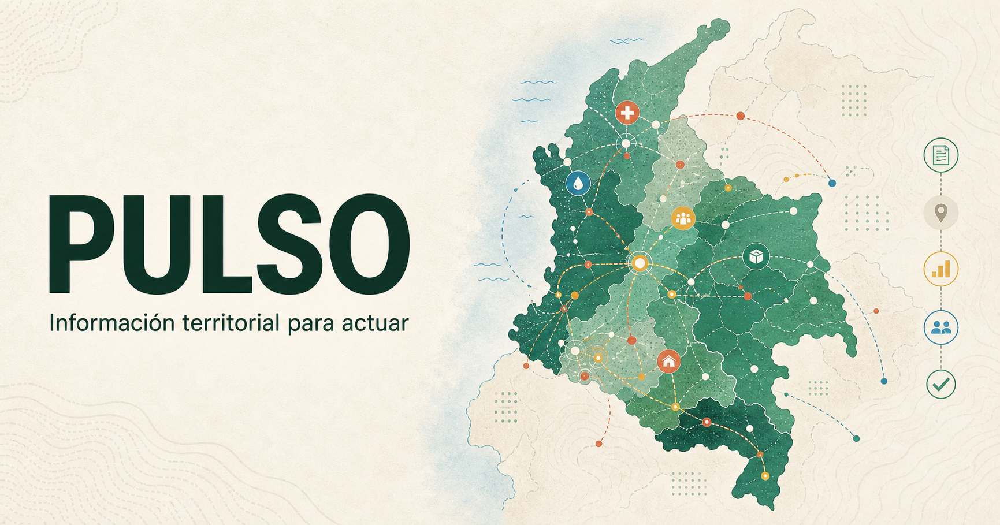
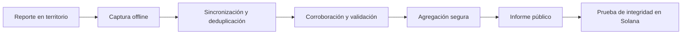

<div align="center">

# PULSO VIDA

### Información territorial para actuar

Infraestructura abierta y local-first para coordinar emergencias, hacer visible lo que ocurre en el territorio y demostrar cómo llega la ayuda.

[**pulso.my**](https://pulso.my) · [Operación desde el día 4](docs/25-day-four-affected-people.md) · [Informe público](docs/24-public-situation-report.md) · [Arquitectura](docs/02-technical-architecture.md)


</div>



## Qué es PULSO VIDA

PULSO VIDA convierte señales dispersas del territorio en información útil, trazable y publicable durante una emergencia. Conecta comunidades, brigadas, profesionales, organizaciones, donantes y autoridades sin exigir conectividad permanente ni conocimientos técnicos.

La primera implementación está enfocada en Colombia, pero el protocolo puede adaptarse a terremotos, inundaciones, incendios, huracanes y otras emergencias en cualquier país.

El sistema responde seis preguntas esenciales:

1. ¿Qué territorios fueron visitados y cuáles siguen sin verificar?
2. ¿Qué daños fueron reportados, corroborados o validados?
3. ¿Qué necesitan las comunidades y con qué prioridad?
4. ¿Qué insumos y donaciones fueron recibidos, asignados o entregados?
5. ¿Qué equipos están trabajando y qué evidencia respalda su actividad?
6. ¿El informe público conserva la misma integridad con la que fue publicado?

Desde el cuarto día, PULSO VIDA no crea un censo digital paralelo: enlaza señales comunitarias, visitas de campo y referencias oficiales en un expediente común. Una persona puede ser atendida sin documento; una referencia no se convierte automáticamente en beneficiario y una posible duplicidad siempre pasa por revisión humana.

## Informe público

La portada de `pulso.my` está diseñada como un informe territorial abierto, no como una landing promocional. Presenta sobre un mapa:

- cobertura y zonas todavía sin verificar;
- daños y viviendas pendientes de inspección;
- necesidades, brechas e insumos en tránsito;
- donaciones registradas, conciliadas, asignadas y entregadas;
- equipos programados, desplegados y activos;
- fecha de corte, fuente y nivel de confianza de cada agregado.

La navegación sigue la jerarquía:

`Colombia → departamento → municipio/distrito → ciudad/localidad → zona operativa`

Las cifras actuales están marcadas como **datos sintéticos de demostración**. PULSO VIDA no publicará información real hasta conectar fuentes verificadas y activar revisión editorial y de privacidad.

## Cómo funciona



PostgreSQL/PostGIS es la fuente de verdad operacional. Solana no almacena personas, fotografías, ubicaciones de hogares ni detalles de beneficiarios: conserva únicamente compromisos criptográficos que permiten demostrar que un corte publicado no fue modificado.

## Productos

| Producto | Responsabilidad |
| --- | --- |
| **Pulso Campo** | Aplicación móvil offline para brigadas, visitas, evaluaciones y evidencia. |
| **Pulso Operaciones** | Consola privada para coordinar equipos, priorizar zonas y revisar información. |
| **Pulso Mapa** | Informe público de cobertura, daños, necesidades, donaciones y equipos. |
| **Pasaporte de Recuperación** | Expediente versionado de cada caso, vivienda, animal o activo. |
| **Pulso Verifica** | Identidad, credenciales profesionales, evidencia y validación. |
| **Protocolo PULSO VIDA** | Contratos abiertos de datos, sincronización, auditoría e integridad. |

## Estado actual

| Área | Estado |
| --- | --- |
| Landing e informe público | Implementados con cinco capas y datos sintéticos |
| API pública de solo lectura | Implementada, cacheable y con contrato `demo / live` |
| Mapa departamental | Implementado; geometrías municipales oficiales pendientes |
| Territorios, zonas y cobertura | API, historial y adaptadores PostgreSQL implementados |
| Captura de campo offline | Visitas, evaluaciones, evidencia y cola IndexedDB implementadas |
| Identidad operacional | Invitaciones, sesiones, passkeys y perfiles de confianza implementados |
| Equipos y asignaciones | Creación, membresías, aceptación e idempotencia implementadas |
| Donaciones e inventario | Catálogo, necesidades, lotes, inspecciones, movimientos y entregas modelados |
| Personas y hogares afectados | Modelo relacional, fuentes externas y cola de posibles duplicados implementados en migración |
| Ingesta oficial Cali | Importador de cifras, acopios, albergues y bancos de sangre implementado |
| PostgreSQL/PostGIS | Doce migraciones; validación en contenedor pendiente |
| Solana | Programa Anchor y pruebas locales aprobadas; Devnet pendiente |
| Program ID | `PuLsRBUdu4JxfP9tPU4WyNvWx7Vu2dS7NfCipm8YBmh` |

## Donaciones y materiales

PULSO VIDA no suma materiales incompatibles ni confunde promesas con entregas. Cada insumo utiliza una unidad canónica y conserva especificación, lote, inspección y movimiento.

```text
promesa → recepción → inspección → aceptación → almacenamiento
        → asignación → despacho → entrega → confirmación
```

La brecha territorial se calcula así:

```text
necesidad validada − entrega utilizable − tránsito confirmado = brecha abierta
```

Consulta el [modelo operativo de donaciones](docs/10-material-donations.md) y el [informe público territorial](docs/24-public-situation-report.md).

## Arquitectura

El P0 usa un monolito modular con workers para mantener despliegues rápidos y transacciones simples.

| Capa | Tecnología |
| --- | --- |
| Web, mapa y campo | Next.js, React y TypeScript |
| Captura offline | IndexedDB y mutaciones idempotentes |
| API | Fastify y contratos Zod |
| Datos territoriales | PostgreSQL + PostGIS |
| Procesamiento asíncrono | Redis + workers |
| Evidencia | Almacenamiento compatible con S3 |
| Identidad | Passkeys/WebAuthn, roles y credenciales verificables |
| Integridad pública | Raíces Merkle ancladas por `pulso_anchor` en Solana |

Principio de disponibilidad: una falla de internet, Solana, RPC o relayer nunca bloquea el registro ni la atención de una emergencia.

## Privacidad y confianza

- La vista pública utiliza agregados territoriales.
- Las ubicaciones precisas de hogares se generalizan o se ocultan.
- No se publican nombres, teléfonos, documentos ni historiales sensibles.
- Reportar, validar, asignar y confirmar entrega son responsabilidades separadas.
- Las correcciones agregan una nueva versión; no sobrescriben silenciosamente el historial.
- Blockchain prueba integridad posterior, no verdad de origen.

## Inicio rápido

### Requisitos

- Node.js 22 o superior.
- pnpm 10.
- Anchor 0.31 y Solana CLI para el programa blockchain.
- PostgreSQL/PostGIS y Redis para persistencia e integración completa.

### Ejecutar localmente

```bash
pnpm install
cp .env.example .env
pnpm dev
```

| Servicio | Dirección |
| --- | --- |
| Informe público | `http://localhost:3000` |
| Pulso Campo | `http://localhost:3000/field` |
| Pulso Operaciones | `http://localhost:3000/operations` |
| API | `http://localhost:3001` |
| Salud | `GET http://localhost:3001/health` |
| Corte público | `GET http://localhost:3001/v1/public/incidents/colombia-2026/report` |
| Fuente oficial Cali | `GET http://localhost:3001/v1/public/sources/cali-official-earthquake-repository/snapshot` |

La API utiliza memoria para demostración. PostgreSQL se activa explícitamente después de aplicar las migraciones:

```bash
PERSISTENCE_DRIVER=postgres pnpm --filter @pulso/api dev
```

Validación completa:

```bash
pnpm check
pnpm test:solana:integration
```

## Estructura

```text
apps/
  web/                 Informe público, Pulso Campo y Pulso Operaciones
  api/                 API operacional y API pública
  worker/              Procesamiento asíncrono
blockchain/solana/     Programa de integridad pulso_anchor
packages/
  domain/              Reglas y contratos de dominio
  schemas/             Validación compartida
infrastructure/        PostgreSQL, PostGIS y despliegue
docs/                  Producto, operación, seguridad y decisiones
research/              Investigación territorial con fuentes
```

## Documentación esencial

### Producto y territorio

- [Visión y principios](docs/00-vision.md)
- [MVP de emergencia](docs/01-emergency-mvp.md)
- [Investigación y despliegue en Colombia](docs/06-colombia-response.md)
- [Plan de construcción](docs/07-roadmap.md)
- [Donaciones de materiales](docs/10-material-donations.md)
- [Experiencia de campo sin fricción](docs/16-zero-friction-field-ux.md)
- [Informe público territorial](docs/24-public-situation-report.md)
- [Día 4: personas afectadas, coordinación y ayuda trazable](docs/25-day-four-affected-people.md)
- [Fuentes e ingesta de datos públicos](docs/26-source-ingestion.md)

### Ingeniería y confianza

- [Arquitectura técnica](docs/02-technical-architecture.md)
- [Modelo de datos](docs/03-data-model.md)
- [Sincronización offline](docs/04-offline-sync.md)
- [Fraude y privacidad](docs/05-trust-fraud-privacy.md)
- [Seguridad de producción](docs/12-production-readiness.md)
- [Identidad operacional](docs/18-identity-trust-p0.md)
- [Programa de auditoría en Solana](docs/23-solana-anchor-program.md)
- [Decisiones de arquitectura](docs/decisions/)

## Principios

- **Offline-first:** el trabajo de campo no depende de una conexión continua.
- **Evidencia antes que afirmaciones:** toda decisión importante debe justificarse.
- **Historial antes que sobrescritura:** corregir crea una nueva versión.
- **Privacidad por diseño:** transparencia no significa exposición personal.
- **Cero fricción:** comunidades y brigadas no necesitan wallet ni SOL.
- **Estándares abiertos:** los datos deben ser interoperables y exportables.

## Dominio y licencia

- Dominio oficial: [**pulso.my**](https://pulso.my)
- Implementación inicial: **PULSO VIDA Colombia**
- Estado: **P0 en construcción**

La licencia de código y datos se definirá antes de aceptar contribuciones externas. No debe asumirse una licencia hasta que exista un archivo `LICENSE` aprobado.
